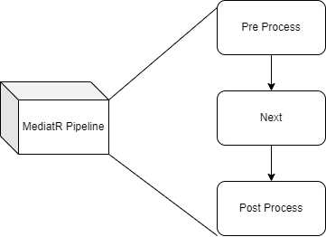

# Mediator & CQRS Patterns In .NET

## Mediator 

#### Problem Statement

Consider having an application that aims to create and update certain profiles (products, customers...).  In this application you have four services (A,B,C,D) that are coupled and communicate to achieve certain goals. Instead of having direct communication among them, in a mediator pattern an entity will exist between these services and somehow `orchestrate` the communication.

For more details on the mediator pattern: [refactoring.guru](https://refactoring.guru/design-patterns/mediator) 

##### MediatR

In .NET core, `MediatorR` is a nugget package that helps implementing the Mediator pattern. Check the source code for an hand-on example.

## CQRS

* CQRS stands for **Command and Query Responsibility Segregation**

  * ​	 Basically this pattern separates read and update operations for a database.

  Extra References: [RolandSall24-Java-Es-CQRS](https://github.com/RolandSall/Microservices-Concepts/blob/main/event-driven-microservices/java/README.md), [Medium article](https://medium.com/design-microservices-architecture-with-patterns/cqrs-design-pattern-in-microservices-architectures-5d41e359768c)


### Main Building Block 

First you need to inject the mediator

```c#
builder.Services.AddMediatR(Assembly.GetExecutingAssembly());
```


Consider a RESTful API that gets all the products you have:

```c#
   [HttpGet(Name = "GetProductsList")]
    public async Task<ActionResult> GetAllProducts()
    {
     return Ok(await _mediator.Send(new GetAllOrdersQuery()));      
    }
```

The second step is to create `GetAllOrdersQuery` class that is passed to the Mediator using the `Send` method

```c#
public class GetAllOrdersQuery: IRequest<List<entities.Product>>
{
    
}
```

`IRequest` will be of type that is expected to be returned.

The Last step is to create the handler. The handler is where you code the logic that happens once a query or a command of a certain type is triggered

```c#
public class GetAllProductOrdersQueryHandler: IRequestHandler<GetAllOrdersQuery, List<entities.Product>>

{    
    private readonly IProductRepo _productRepo;

    public GetAllProductOrdersQueryHandler(IProductRepo productRepo)
    {
        _productRepo = productRepo;
    }

    public async Task<List<entities.Product>> Handle(GetAllOrdersQuery request, CancellationToken cancellationToken)
    {
        return _productRepo.GetAllProducts();
    }
}
```

### Mediator Behaviors

As previously established, a handler that takes care of receiving queries or commands and returns a response. Now, let's say you want to have a certain type of validation. One way to do it is to add inside the handler a validation procedure. However, the handler now has two main roles a validation and a handling job which is not preferable since it violates the single responsibility principle. What we can do is to have a sort of a pipeline (illustrated in the figure below)



Now you have the logic separated from your validation and you can different levels of pipelines before proceeding to the business implementation of your handler.

The first step is to add the following nugget package

```yaml
    <PackageReference Include="MediatR.Extensions.Microsoft.DependencyInjection" Version="10.0.1" />
    <PackageReference Include="FluentValidation.DependencyInjectionExtensions" Version="11.1.0" />
```

The next step is to create your validator class

```c#
using FluentValidation;
using mediator_cqrs.Commands.Product;

namespace mediator_cqrs.Validation
{
    public class CreateProductCommandValidator : AbstractValidator<CreateProductCommand>
    {
        public CreateProductCommandValidator()
        {
            RuleFor(x => x.SerialNumber).NotNull().NotEqual(0);
            RuleFor(x => x.Name).NotNull().NotEqual("foo");
        }       
        
    }
}
```

The validator will be triggered based on the command/query given.

The third step is to implement the `Validator Behaviour` , the latter file is a template that is used in this context. First you need to implement the `IPipelineBehavior` . The second step is to fetch all of the validators that exist in your application using the following

```c#
    private readonly IEnumerable<IValidator<TRequest>> _validators;
```

Finally, you need to implement `Handler` method which you check your validators can fetch the correct one to check if the rules failed or pass.

```c#
using FluentValidation;
using MediatR;

namespace mediator_cqrs.Behaviors;

public class ValidationBehaviour<TRequest, TResponse> : IPipelineBehavior<TRequest, TResponse>
    where TRequest : IRequest<TResponse>
{
    
    private readonly IEnumerable<IValidator<TRequest>> _validators;

    public ValidationBehaviour(IEnumerable<IValidator<TRequest>> validators)
    {
        _validators = validators;
    }

    public async Task<TResponse> Handle(TRequest request, CancellationToken cancellationToken, RequestHandlerDelegate<TResponse> next)
    {
        if (_validators.Any())
        {
            var context = new ValidationContext<TRequest>(request);

            var failures = _validators
                .Select(v => v.Validate(context))
                .SelectMany(result => result.Errors)
                .Where(f => f != null)
                .ToList();

            if (failures.Any())
                throw new ValidationException(failures);
        }
       return await next();
       
        // post
    }
}
```

The `next()` function will allow the code to continue execution in case the pre-processing executed successfully. 

```coffeescript
Validation failed: 
 -- SerialNumber: 'Serial Number' must not be equal to '0'. Severity: Error
 -- Name: 'Name' must not be equal to 'foo'. Severity: Error
```

