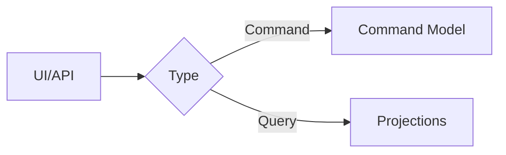

# CQRS

In this README.md file I will discuss the concepts of CQRS. 

For application with different programming languages

[mediator](mediaor-cqrs)

[axon](axon)

Command-Query Responsibility Separation is a pattern that differentiate between commands and queries.

~~~gfm

~~~

Two models are being used [reference ddd section]().

* Command Models focuses on executing tasks expressed in operations containing the needed data
* Query Models focus on retrieving data.

## Synchronization of models

The query model should be able to adjust to the different command models that are executed. Multiple solution can be adopted:

*  Shared Data source - (violates microservices patterns)
* Stored Procedure
* Event-Driven Architecture (This is what is being focused on currently)

Hence the commands and query are linked by events to catch any modifications.

## Commands Model

