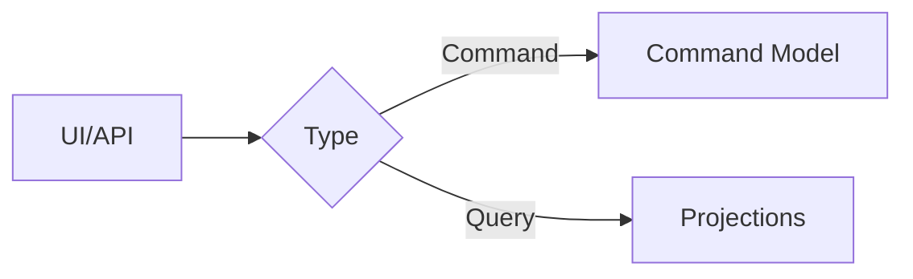

# CQRS

In this README.md file I will discuss the concepts of CQRS. 

For a coding application refer to: [mediator](https://github.com/RolandSall/Microservices-Concepts/tree/main/design-patterns/Mediator-CQRS/dotnet-core), [axon](https://github.com/RolandSall/Microservices-Concepts/tree/main/event-driven-microservices/java/templates/cqrs-eventsourcing-axon)

Command-Query Responsibility Separation is a pattern that differentiate between commands and queries.

Two [models](https://github.com/RolandSall/Microservices-Concepts/tree/main/software-design/DDD) are being used.

* Command Models focuses on executing tasks expressed in operations containing the needed data
* Query Models focus on retrieving data.

## Synchronization of models

The query model should be able to adjust to the different command models that are executed. Multiple solution can be adopted:

*  Shared Data source - (violates microservices patterns)
* Stored Procedure
* Event-Driven Architecture (This is what is being focused on currently)

Hence the commands and query are linked by events to catch any modifications.

## Commands Model

