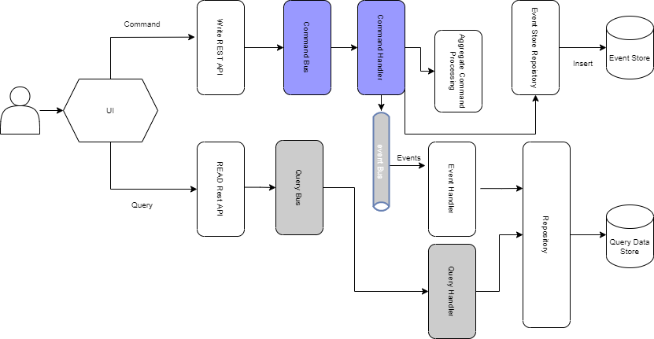

# Event Driven Micro-Services: CQRS & Event Sourcing Patterns

The diagram below illustrated a microservice architecture. Normally in such architecture the clients communicate with a gateway service using HTTP/s requests. 

* The `Gateway-Service` main role is to re-route the request to the correct service.
* The `Config-Service` is used to store metadata and configuration for each microservice that are fetched on runtime.
* The `Discovery-Service` is used to locate the different services location. The latter is achieved by having a registration from each service with the `Discovery-Service` once launched.

## Types of Communication

Microservices can communicate in two ways: Synchronous Communication using REST of Asynchronous.

#### Synchronous Communication

 In synchronous communication, the services will communicate over REST APIs. In the case of spring boot/cloud `Open Feign` provides an interface to establish such communication. However, the downside of this approach is basically the overhead that might occur if a request generates a chain of other requests which might slow down the system.

Another question is very important to raise: How to synchronize multiple database instances? Such problems can be solved using brokers (RabbitMQ, Kafka)

#### Asynchronous Communication

In this solution, an event bus is used. The services will subscribe to this bus and publish any new events that occurs. On each modification all subscribed services will catch any new modification using the event handlers. Hence, this approach will guarantee data consistency and synchronized system.

## CQRS And Event  Sourcing

These techniques are frequently paired together. Refer to this [thread](https://stackoverflow.com/questions/47048839/cqrs-and-event-sourcing-difference) for more descriptive answers.

#### Event Sourcing

> The fundamental idea of Event Sourcing is that of ensuring every change to the state of an application is captured in an event object, and that these event objects are themselves stored in the sequence they were applied for the same lifetime as the application state itself. ~ [Martin Fowler](https://martinfowler.com/)

​	Such techniques has the following advantages:

* Easy analyze and debug problems: Since you have everything recorded, you can replicate problems that occurs.
* You can always check the state of your database at any given point by replaying the series of occurred events.
* Performance: Asynchronous communication with the bus

 

##### Command

A command is an external solicitation on the system. It is normally auto-descriptive. The flow goes as follow

.png)

The application will implement a number of handlers that will get triggered based on the command that the application receive. This handler will perform a certain logic than this event will be persisted in a dedicated store. An event-sourcing handler will then be triggered to change the state of the application. (Check the source code for a hands-on example)

#### CQRS

CQRS: Command Query Responsibility Segregation.

##### Command

In this pattern, a CQRS command is request that aims to modify the state of an object. Mainly to insert, update or delete operations.

##### Query

Queries are the requests that aims to read data. `Select` requests which aims to read the data. The latter are generated by `GET` requests

*CQRS with Event Sourcing*

Advantage of CQRS:

1. Separating write activity from ready activities allows you to use the best database technology.
2. Read activity tends to be more frequent than writing, thus you can reduce response latency by placing read data sources in strategic geolocations for better performance.

Extra References: [CQRS-Medium-Article](https://betterprogramming.pub/cqrs-software-architecture-pattern-the-good-the-bad-and-the-ugly-e9d6e7a34daf)

