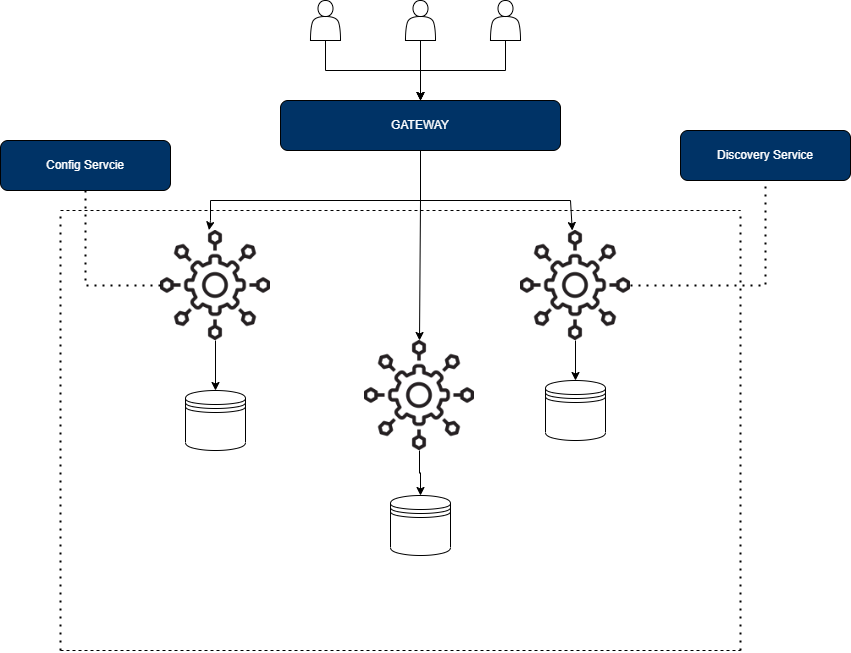
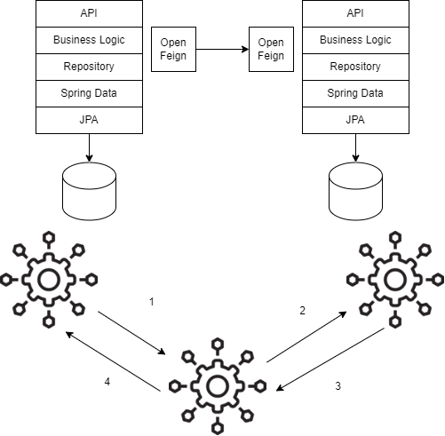
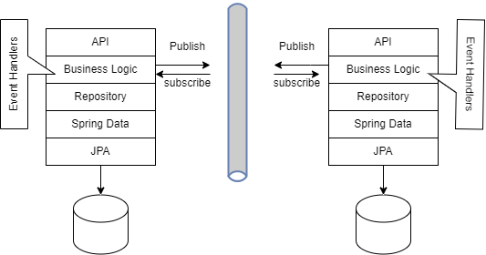

# Event Driven Micro-Services: CQRS & Event Sourcing Patterns

The diagram below illustrated a microservice architecture. Normally in such architecture the clients communicate with a gateway service using HTTP/s requests. 

* The `Gateway-Service` main role is to re-route the request to the correct service.
* The `Config-Service` is used to store metadata and configuration for each microservice that are fetched on runtime.
* The `Discovery-Service` is used to locate the different services location. The latter is achieved by having a registration from each service with the `Discovery-Service` once launched.

## Types of Communication

Microservices can communicate in two ways: Synchronous Communication using REST of Asynchronous.

#### Synchronous Communication

 In synchronous communication, the services will communicate over REST APIs. In the case of spring boot/cloud `Open Feign` provides an interface to establish such communication. However, the downside of this approach is basically the overhead that might occur if a request generates a chain of other requests which might slow down the system.

Another question is very important to raise: How to synchronize multiple database instances? Such problems can be solved using brokers (RabbitMQ, Kafka)

#### Asynchronous Communication

In this solution, an event bus is used. The services will subscribe to this bus and publish any new events that occurs. On each modification all subscribed services will catch any new modification using the event handlers. Hence, this approach will guarantee data consistency and synchronized system.

